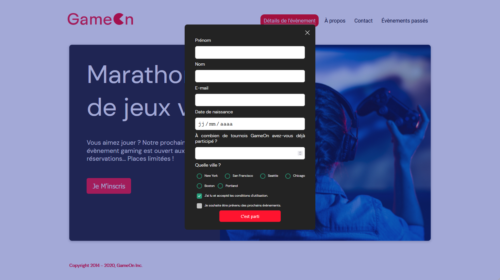
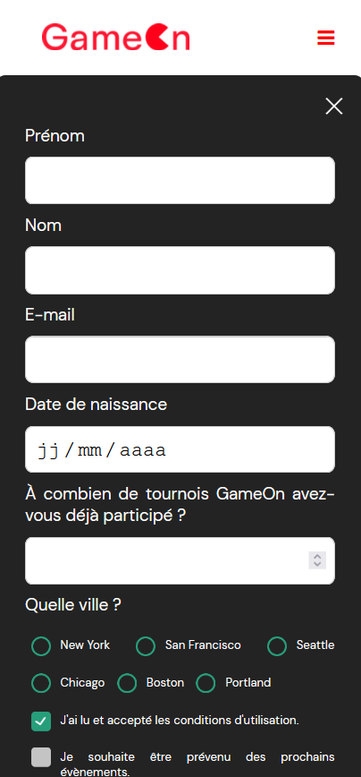

 

  

  <h3 align="center">GameOn</h3>

  

    GameOn est une entreprise spécialisée dans les conférences et les concours de jeux.
     
    <a href="https://laury-thiallier.github.io/LauryTHIALLIER_4_31102021/"><strong>ALLER SUR LE SITE</strong></a>
  

## À PROPOS DU PROJET :

### VERSION DESKTOP :
  

    
  

### VERSION MOBILE :
  

    
  

### LANGAGES / LIBRAIRIES / FONTS
* [HTML](https://github.com/Laury-THIALLIER/LauryTHIALLIER_4_31102021/search?l=html)
* [CSS](https://github.com/Laury-THIALLIER/LauryTHIALLIER_4_31102021/search?l=CSS)
* [JavaScript](https://github.com/Laury-THIALLIER/LauryTHIALLIER_4_31102021/search?l=javascript)

## PROJET GAMEON

### SCÉNARIO :

Vous avez récemment été embauché comme développeur Front-End junior dans une PME, GameOn, spécialisée dans les conférences et les concours de jeux. 
Vous avez fait du shadowing de votre développeur principal, Erika, pour suivre son travail au quotidien.

## MES OUTILS

#### ÉDITEUR DE CODE : [Visual Studio Code](https://code.visualstudio.com/)
#### NAVIGATEURS : [Brave](https://brave.com/fr/) / [Firefox Developer Edition](https://www.mozilla.org/fr/firefox/developer/)
#### OS : [Windows 10 Pro](https://www.microsoft.com/fr-fr/p/windows-10-pro/df77x4d43rkt?rtc=1&activetab=pivot:overviewtab)
